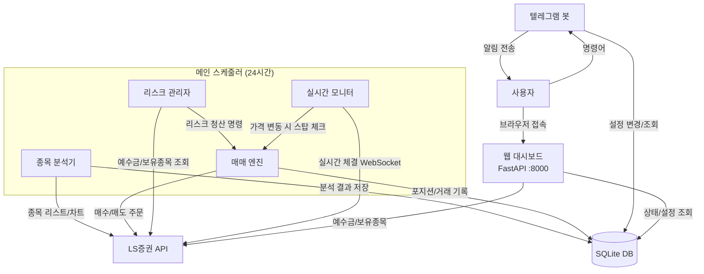
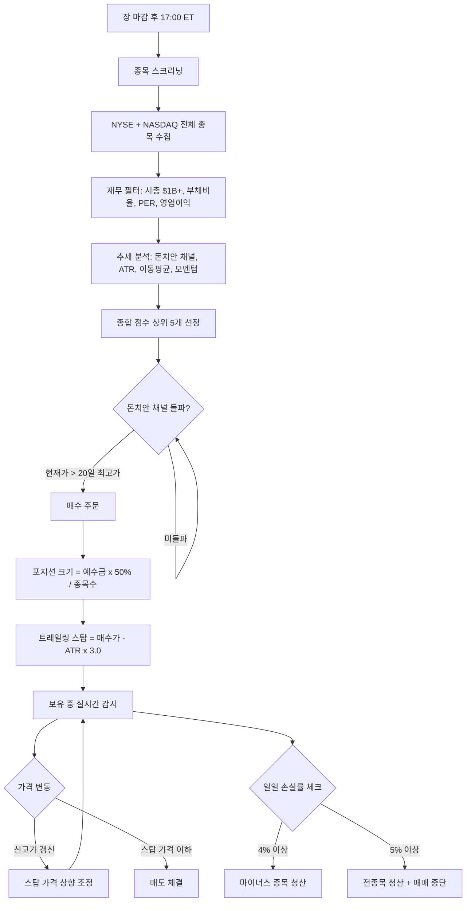

# Turtle Trading Bot

LS증권 API를 이용한 **해외주식 터틀 트레이딩 자동매매 봇**입니다.

돈치안 채널 돌파 매수 + ATR 기반 트레일링 스탑 매도 전략으로, 24시간 자동 운영되며 텔레그램으로 원격 제어할 수 있습니다.

---

## 시스템 구조



## 매매 흐름



## 일일 스케줄

```mermaid
gantt
    title 일일 운영 스케줄 (미국 동부시간 ET)
    dateFormat HH:mm
    axisFormat %H:%M

    section 분석
    장마감 리포트           :done, 06:30, 30min
    리스크 초기화           :done, 07:00, 10min
    종목 스크리닝           :active, 17:00, 30min

    section 주간거래
    프리마켓 매수 체크 (30분 간격) :04:00, 240min

    section 정규장
    정규장 매수 체크 (15분 간격)  :09:30, 390min
    트레일링 스탑 (5분 간격)      :09:30, 390min
    실시간 모니터링               :09:30, 390min
    리스크 감시 (1분 간격)        :09:30, 390min
    장마감 정리                  :16:05, 10min
```



---

## 실행 방법

### 1. 사전 준비

- **Python 3.13+**
- **LS증권 계좌** + API 키 발급 ([LS증권 Open API](https://openapi.ls-sec.co.kr/))
- **텔레그램 봇** 생성 ([BotFather](https://t.me/BotFather))

### 2. 설치

```bash
# 프로젝트 클론
git clone <repository-url>
cd turtle-trading-bot

# 가상환경 생성 및 활성화
python3 -m venv venv
source venv/bin/activate

# 의존성 설치
pip install -r requirements.txt
```

### 3. 환경 설정

```bash
cp .env.example .env
```

`.env` 파일을 열어 API 키를 입력합니다:

```env
# LS증권 API (해외주식 실전계좌)
LS_APPKEY=your_appkey_here
LS_APPSECRETKEY=your_appsecretkey_here

# 텔레그램 봇
TELEGRAM_BOT_TOKEN=your_bot_token_here
TELEGRAM_CHAT_ID=your_chat_id_here
```

### 4. 실행

```bash
source venv/bin/activate
python3 main.py
```

`data/` 디렉터리는 최초 실행 시 자동 생성됩니다.

실행하면 **웹 대시보드**(http://localhost:8000)와 **트레이딩 봇**이 함께 시작됩니다.
기본값은 **드라이런 모드**(실제 주문 없이 시뮬레이션)입니다.

백그라운드 실행:
```bash
nohup python3 main.py > data/bot.log 2>&1 &
```

### 5. 제어 방법

#### 웹 대시보드 (http://localhost:8000)

브라우저에서 접속하여 실시간으로 봇을 제어할 수 있습니다:
- 봇 상태 / 예수금 / 보유종목 실시간 확인
- 모드 전환 (DRY / LIVE)
- 매매 중단 / 재개
- 전략 파라미터 변경 (돈치안, ATR, 종목 수, 예수금 비율)
- 오늘 매매 내역 조회
- 로그 실시간 확인

#### 텔레그램 봇

| 명령어 | 설명 |
|--------|------|
| `/help` | 명령어 목록 |
| `/status` | 보유종목, 모드, 상태 |
| `/mode dry` / `/mode live` | 모드 전환 |
| `/set channel 20` | 돈치안 채널 기간 변경 |
| `/set atr 3.0` | 트레일링 스탑 ATR 배수 |
| `/set stocks 5` | 최대 보유 종목 수 |
| `/set ratio 50` | 예수금 사용 비율(%) |
| `/settings` | 전체 설정값 보기 |
| `/stop` / `/start` | 매매 중단 / 재개 |
| `/report` | 오늘 매매 리포트 |

---

## 프로젝트 구조

```
turtle-trading-bot/
├── main.py                 # 시작점 (FastAPI + 스케줄러 통합)
├── config.py               # 환경 설정 (.env 로드 + 기본값)
├── scheduler.py            # 메인 스케줄러 (24시간 루프)
├── analyzer/
│   ├── stock_screener.py   # 종목 스크리닝 (재무 + 추세)
│   └── trend_analyzer.py   # 기술적 분석 (돈치안, ATR, MA)
├── trader/
│   ├── ls_client.py        # LS증권 API 래퍼
│   ├── engine.py           # 매매 엔진 (매수/매도 실행)
│   └── realtime.py         # WebSocket 실시간 모니터링
├── risk/
│   └── risk_manager.py     # 리스크 관리 (4%/5% 손실 한도)
├── tgbot/
│   └── bot.py              # 텔레그램 봇 (알림 + 명령어)
├── web/
│   ├── api.py              # REST API (FastAPI 라우터)
│   └── dashboard.html      # 웹 대시보드 (단일 HTML)
├── database/
│   ├── models.py           # DB 스키마 정의
│   └── repository.py       # DB 읽기/쓰기
├── data/
│   ├── trading.db          # SQLite 데이터베이스 (자동 생성)
│   └── turtle.log          # 실행 로그
├── .env                    # API 키 (비공개)
├── .env.example            # 환경변수 템플릿
└── requirements.txt        # 의존성 목록
```

## 핵심 전략 파라미터

| 파라미터 | 기본값 | 설명 |
|---------|--------|------|
| 돈치안 채널 기간 | 20일 | 매수 신호 기준 (N일 최고가 돌파) |
| ATR 기간 | 20일 | 변동성 계산 기간 |
| ATR 배수 | 3.0 | 트레일링 스탑 거리 (ATR x 배수) |
| 최대 보유 종목 | 5개 | 동시 보유 가능 종목 수 |
| 예수금 사용 비율 | 50% | 전체 예수금 중 매매에 사용할 비율 |
| 일일 손실 경고 | 4% | 마이너스 종목 청산 |
| 일일 손실 비상 | 5% | 전종목 청산 + 당일 매매 중단 |

## 기술 스택

| 항목 | 기술 |
|------|------|
| 증권 API | [programgarden-finance](https://pypi.org/project/programgarden-finance/) 1.4.3 |
| 웹 대시보드 | FastAPI + uvicorn |
| 비동기 | asyncio + aiosqlite |
| 스케줄러 | APScheduler |
| 데이터베이스 | SQLite |
| 재무 데이터 | yfinance |
| 알림/제어 | python-telegram-bot |

## 주의사항

- **드라이런 모드로 먼저 충분히 테스트** 후 실전 전환하세요.
- 실전 모드에서는 **실제 주문이 체결**됩니다. 손실 위험이 있습니다.
- 리스크 관리(4%/5% 한도)가 정상 동작하는지 반드시 확인하세요.
- API 키는 `.env` 파일에만 저장하고, **절대 커밋하지 마세요.**
