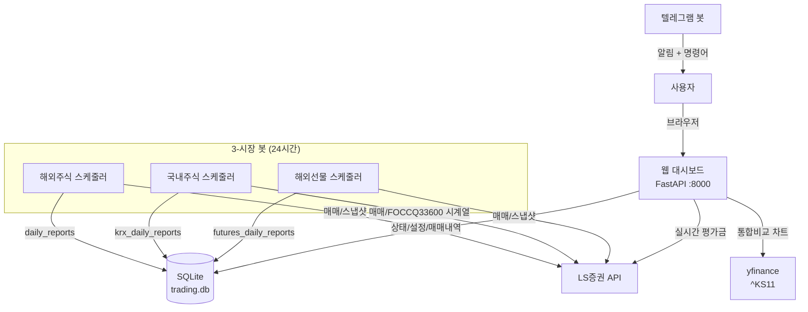
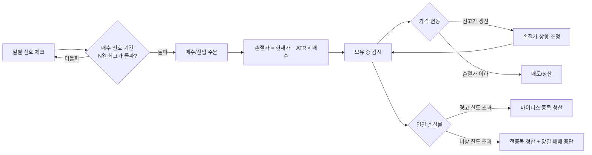

# Turtle Trading Bot

## 🌱 프로그램동산 커뮤니티

| | |
|---|---|
| 🎥 **YouTube 채널** | <https://youtube.com/@programgarden> |
| 💬 **카카오톡 단톡방** | <https://open.kakao.com/o/gKVObqUh> |
| 🌐 **프로그램동산 자동화매매 플랫폼** | <https://programgarden.com> |

[](https://youtube.com/@programgarden)
[](https://open.kakao.com/o/gKVObqUh)
[](https://programgarden.com)

> 라이브 강의 · 자료 · 자동화매매 토론은 위 채널에서 만나요.

---

LS증권 API를 이용한 **터틀 트레이딩 자동매매 봇**입니다.

**해외주식**(미국 NYSE/NASDAQ), **국내주식**(KRX), **해외선물**(홍콩 HKEX) 3개 시장을 동시에 자동 매매하며,
돈치안 채널 돌파 매수 + ATR 기반 트레일링 스탑 매도 전략으로 24시간 자동 운영됩니다.
**라이트 테마 웹 대시보드**와 텔레그램으로 원격 제어하고, 4개 시리즈(해외주식·국내주식·해외선물·코스피지수)
**누적 수익률 통합 비교 차트**를 한 화면에서 볼 수 있습니다.

---

## 시스템 구조



## 매매 흐름 (3개 시장 공통)



각 시장별 거래 시간 (한국시간 KST):
- **해외주식 NYSE/NASDAQ**: 정규장 22:30~05:00 (서머타임 기준)
- **국내주식 KRX**: 09:00~15:30
- **해외선물 HKEX**: T세션 10:15~13:00 + 14:00~17:30 / T+1세션(야간) 18:15~04:00

---

## 웹 대시보드

라이트 테마 단일 페이지 5개 탭:

| 탭 | 설명 |
|---|---|
| 📈 **해외주식** | LS 실계좌. 모드(DRY/LIVE) · 계좌 · 보유종목 · 일봉차트 · 전략 · API키 · 오늘 매매 |
| 🇰🇷 **국내주식** | LS 실계좌. 동일 구성 (KRX 종목 코드 기준) |
| 📊 **해외선물** | LS 모의투자. 동일 구성 (홍콩 HKEX 6개 상품) |
| 📉 **통합비교** | 4시리즈 누적 수익률 차트 — 해외주식·국내주식·해외선물·코스피지수(^KS11) |
| 📋 **로그** | 시스템 로그 실시간 보기 |

**통합비교 차트**
- 기간 선택: 7 / 14 / 30(기본) / 60 / 90일
- 일별 수익률 누적 곱셈 `Π(1 + rᵢ) − 1` → 입출금 영향 제외된 정확한 누적수익률
- 국내주식: LS `FOCCQ33600` TR의 `TermErnrat` 시계열을 그대로 사용
- 해외주식/선물: LS API가 시계열을 안 주므로 봇이 매일 평가금 스냅샷을 DB에 누적
- 코스피지수: yfinance `^KS11` 종가, **캐시 없이** 매 새로고침마다 새로 조회

## 일별 스냅샷 누적

LS API는 국내주식만 일별 시계열(`FOCCQ33600`)을 제공하므로, 해외주식·해외선물은
봇이 직접 매일 평가금을 DB에 누적 저장합니다.

| 시장 | 저장 시각 (KST) | TR |
|---|---|---|
| 해외주식 | 봇 시작 시 + 매일 16:10 | `COSOQ00201` 오늘 스냅샷 |
| 해외선물 | 봇 시작 시 + 매일 18:10 | `CIDBQ03000` 오늘 스냅샷 |
| 국내주식 | 봇 시작 시 + 매일 15:40 | `FOCCQ33600` 시계열 백필 |

---

## 실행 방법

### 1. 사전 준비
- **Python 3.13+**
- **LS증권 계좌** + API 키 ([LS증권 Open API](https://openapi.ls-sec.co.kr/))
- **텔레그램 봇** (선택, [BotFather](https://t.me/BotFather))

### 2. 설치
```bash
git clone https://github.com/programgarden/offline_class_20250405.git
cd offline_class_20250405

python3 -m venv venv
source venv/bin/activate
pip install -r requirements.txt
```

### 3. 환경 설정
```bash
cp .env.example .env
```

`.env` 파일에 LS증권 API 키를 입력:

```env
# LS증권 - 해외주식 실전계좌
LS_APPKEY=your_appkey_here
LS_APPSECRETKEY=your_appsecretkey_here

# LS증권 - 국내주식 실전계좌
APPKEY_KOREA=your_korea_appkey_here
APPSECRET_KOREA=your_korea_appsecretkey_here

# LS증권 - 해외선물 모의투자
APPKEY_FUTURE_FAKE=your_futures_paper_appkey_here
APPSECRET_FUTURE_FAKE=your_futures_paper_appsecretkey_here

# LS증권 - 해외선물 실전투자 (선택)
FUTURES_LIVE_APPKEY=
FUTURES_LIVE_APPSECRETKEY=

# 텔레그램 봇 (선택)
TELEGRAM_BOT_TOKEN=your_bot_token_here
TELEGRAM_CHAT_ID=your_chat_id_here
```

> API 키는 웹 대시보드에서도 설정 가능합니다 (DB 저장). 시작 시 DB → config 순서로 로드됩니다.

### 4. 실행
```bash
source venv/bin/activate
python3 main.py
```

기본 포트가 사용 중이면:
```bash
./venv/bin/python -m uvicorn main:app --host 0.0.0.0 --port 8001
```

`data/` 디렉터리는 최초 실행 시 자동 생성됩니다.

실행하면 **웹 대시보드**(http://localhost:8000)와 **3개 봇**(해외주식 · 국내주식 · 해외선물)이 함께 시작됩니다.
기본값은 **드라이런 모드**(실제 주문 없이 시뮬레이션)입니다.

백그라운드 실행:
```bash
nohup python3 main.py > data/bot.log 2>&1 &
```

### 5. 테스트
```bash
pytest
```

---

## 핵심 전략 파라미터

| 파라미터 | 기본값 | UI 표시명 | 의미 |
|---|---|---|---|
| `donchian_period` | 20 | **매수 신호 기간 (일)** | 최근 N일 중 최고가 돌파 시 매수/진입 |
| `atr_multiplier` | 3.0 | **손절 폭 배수** | 가격 변동폭(ATR) × 배수 = 손절 거리 |
| `max_stocks` | 5 | 최대 종목/계약 수 | 동시 보유 한도 |
| `capital_ratio` | 50% | 예수금 비율 | 매매에 사용할 예수금 비율 |

모두 3개 시장별로 독립 설정 가능 (`donchian_period`, `krx_donchian_period`, `futures_donchian_period`).

### 리스크 한도

| 시장 | 일일 손실 경고 | 일일 손실 비상 |
|---|---|---|
| 해외주식 | 4% (마이너스 종목 청산) | 5% (전종목 청산 + 매매 중단) |
| 국내주식 | 4% | 5% |
| 해외선물 | 3% (증거금 대비) | 5% + 증거금 80% 한도 초과 시 진입 차단 |

---

## 텔레그램 명령어

| 명령어 | 설명 |
|--------|------|
| `/help` | 명령어 목록 |
| `/status` | 보유종목, 모드, 상태 |
| `/mode dry` / `/mode live` | 모드 전환 |
| `/set channel 20` | 매수 신호 기간 변경 |
| `/set atr 3.0` | 손절 폭 배수 변경 |
| `/set stocks 5` | 최대 보유 종목 수 |
| `/set ratio 50` | 예수금 사용 비율(%) |
| `/settings` | 전체 설정값 보기 |
| `/stop` / `/start` | 매매 중단 / 재개 |
| `/report` | 오늘 매매 리포트 |

---

## 프로젝트 구조

```
offline_class_20250405/
├── main.py                     # 시작점 (FastAPI + 3개 봇 통합)
├── config.py                   # 환경 설정 (.env + 기본값)
├── scheduler.py                # 해외주식 스케줄러
├── krx_scheduler.py            # 국내주식 스케줄러
├── futures_scheduler.py        # 해외선물 스케줄러
├── analyzer/
│   ├── stock_screener.py       # 해외주식 종목 스크리닝
│   └── trend_analyzer.py       # 기술적 분석
├── trader/
│   ├── ls_client.py            # 해외주식 API 래퍼
│   ├── engine.py / realtime.py # 해외주식 엔진 + 실시간
│   ├── krx_client.py           # 국내주식 API 래퍼 (NEW)
│   ├── krx_engine.py           # 국내주식 매매 엔진 (NEW)
│   ├── futures_client.py       # 해외선물 API 래퍼
│   └── futures_engine.py / futures_realtime.py
├── risk/
│   ├── risk_manager.py         # 해외주식 리스크
│   └── futures_risk.py         # 해외선물 리스크
├── tgbot/bot.py                # 텔레그램 봇
├── web/
│   ├── api.py                  # REST API (KRX + 통합비교 + 코스피 포함)
│   └── dashboard.html          # 라이트 테마 단일 HTML (5개 탭)
├── database/
│   ├── models.py               # DB 스키마 (krx_* 테이블 추가)
│   └── repository.py
├── tests/                      # 테스트 코드
├── data/                       # 런타임 (DB, 로그) — 자동 생성
├── .env / .env.example         # API 키
└── requirements.txt
```

---

## 기술 스택

| 항목 | 기술 |
|------|------|
| 증권 API | [programgarden-finance](https://pypi.org/project/programgarden-finance/) |
| 웹 대시보드 | FastAPI + uvicorn + lightweight-charts |
| 비동기 | asyncio + aiosqlite |
| 스케줄러 | APScheduler |
| 데이터베이스 | SQLite |
| 벤치마크 데이터 | yfinance (`^KS11` 코스피지수) |
| 알림/제어 | python-telegram-bot |

---

## 주의사항

- **드라이런 모드로 먼저 충분히 테스트** 후 실전 전환하세요.
- 실전 모드에서는 **실제 주문이 체결**됩니다. 손실 위험이 있습니다.
- 리스크 관리 한도(주식 4%/5%, 선물 3%/5%)가 정상 동작하는지 반드시 확인하세요.
- API 키는 `.env` 파일에만 저장하고, **절대 커밋하지 마세요.**
- 본 프로젝트는 교육/연구 목적이며, 운영 손익에 대한 책임은 사용자 본인에게 있습니다.

